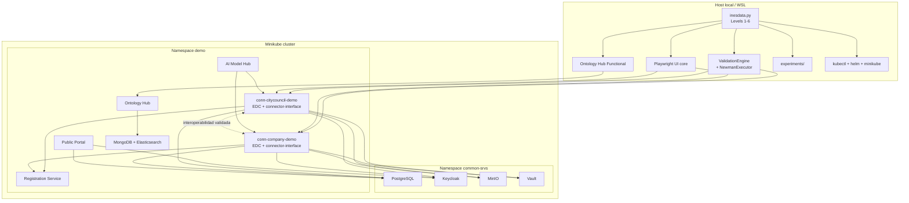

# 12. Entorno Local de Validación

## Propósito

Este documento describe el entorno **LOCAL actual** de validación de
`Validation-Environment` tal y como está implementado hoy en el repositorio.

Su objetivo es servir como:

- representación fiel del entorno PT5 local
- base para entender la ejecución real de A5.1 y A5.2
- punto de partida para derivar posteriormente el entorno productivo distribuido

La fuente de verdad de este documento es la implementación real en:

- `inesdata.py`
- `adapters/inesdata/`
- `framework/`
- `validation/`
- `inesdata-deployment/`

## 1. Entorno local real

El entorno actual no está distribuido en varias máquinas. Está comprimido en un
único clúster local `Minikube` y se organiza en dos namespaces principales:

- `common-srvs`
- `demo`

### 1.0 Inventario resumido del entorno local

| Capa | Elementos reales hoy | Papel |
| --- | --- | --- |
| Infraestructura | `Minikube`, `ingress`, `minikube tunnel` | soporte de ejecución local |
| Servicios comunes | PostgreSQL, Keycloak, MinIO, Vault | identidad, secretos, almacenamiento y persistencia compartida |
| Dataspace base | `registration-service`, `public-portal` | registro y acceso al dataspace |
| Conectores | `conn-citycouncil-demo`, `conn-company-demo` | interoperabilidad provider-consumer |
| Componentes | `ontology-hub`, `ai-model-hub` | capacidades funcionales opcionales |
| Validación | Newman, Playwright core, `Ontology Hub Functional`, reporting | validación API, UI y por componente |

### 1.1 Infraestructura local

La base técnica del entorno es:

- `Minikube` con perfil `minikube`
- addon `ingress`
- `minikube tunnel` como requisito operativo para Level 3 y superiores

Referencias:

- `inesdata.py`
- `adapters/inesdata/deployment.py`

### 1.2 Servicios comunes

En `common-srvs` viven los servicios compartidos por el dataspace:

- PostgreSQL
- Keycloak
- MinIO
- Vault

Referencias:

- `inesdata-deployment/common/values.yaml`
- `inesdata.py`

### 1.3 Dataspace base

En el namespace `demo` se despliega el dataspace base:

- `registration-service`
- `public-portal`

Estos servicios forman parte del dataspace y no se tratan como componentes
opcionales de `Level 5`.

Referencias:

- `inesdata-deployment/dataspace/registration-service/values-demo.yaml`
- `inesdata-deployment/dataspace/public-portal/values-demo.yaml`
- `adapters/inesdata/components.py`

### 1.4 Conectores

El dataspace demo actual usa dos conectores:

- `conn-citycouncil-demo`
- `conn-company-demo`

Cada conector incluye:

- runtime EDC
- `connector-interface`
- base de datos propia en PostgreSQL
- integración con Keycloak
- bucket propio en MinIO
- acceso a Vault
- integración con `registration-service`

Referencias:

- `inesdata-deployment/deployer.config`
- `inesdata-deployment/connector/values-conn-citycouncil-demo.yaml`
- `adapters/inesdata/connectors.py`

### 1.5 Componentes funcionales desplegables

Hoy el framework reconoce dos componentes opcionales reales en `Level 5`:

- `ontology-hub`
- `ai-model-hub`

`Ontology Hub` se despliega además con dependencias internas propias:

- MongoDB
- Elasticsearch

Referencias:

- `inesdata-deployment/deployer.config`
- `inesdata-deployment/components/ontology-hub/values-demo.yaml`
- `inesdata-deployment/components/ai-model-hub/values-demo.yaml`

### 1.6 Capa de validación

La capa de validación no vive dentro del clúster. Se ejecuta desde el host
local y usa:

- `inesdata.py` como orquestador por niveles
- `ValidationEngine` para el flujo API
- `NewmanExecutor` para las colecciones core
- Playwright para la validación UI
- `validation/components/` para validaciones por componente
- `experiments/` para persistencia de resultados

### 1.7 Inventario operativo por elemento

| Elemento | Namespace | Ruta o chart | Dependencias principales | Estado actual |
| --- | --- | --- | --- | --- |
| PostgreSQL | `common-srvs` | `inesdata-deployment/common/values.yaml` | almacenamiento persistente local | activo |
| Keycloak | `common-srvs` | `inesdata-deployment/common/values.yaml` | PostgreSQL | activo |
| MinIO | `common-srvs` | `inesdata-deployment/common/values.yaml` | almacenamiento local | activo |
| Vault | `common-srvs` | `inesdata-deployment/common/values.yaml` | persistencia local | activo |
| Registration Service | `demo` | `inesdata-deployment/dataspace/registration-service/` | PostgreSQL, Keycloak | activo |
| Public Portal | `demo` | `inesdata-deployment/dataspace/public-portal/` | PostgreSQL, Keycloak | activo |
| Connector `citycouncil` | `demo` | `inesdata-deployment/connector/values-conn-citycouncil-demo.yaml` | PostgreSQL, Keycloak, MinIO, Vault, registration-service | activo |
| Connector `company` | `demo` | `inesdata-deployment/connector/values-conn-company-demo.yaml` | PostgreSQL, Keycloak, MinIO, Vault, registration-service | activo |
| Ontology Hub | `demo` | `inesdata-deployment/components/ontology-hub/` | MongoDB, Elasticsearch | activo y validado |
| AI Model Hub | `demo` | `inesdata-deployment/components/ai-model-hub/` | conectores del dataspace | desplegable, validación parcial |
| Semantic Virtualization | n/a | no existe chart actual | n/a | gap |

### 1.8 Puntos de entrada reales

| Hostname o endpoint | Capa | Uso real hoy |
| --- | --- | --- |
| `keycloak.dev.ed.dataspaceunit.upm` | servicios comunes | autenticación |
| `keycloak-admin.dev.ed.dataspaceunit.upm` | servicios comunes | administración de identidad |
| `minio.dev.ed.dataspaceunit.upm` | servicios comunes | S3/objetos |
| `console.minio-s3.dev.ed.dataspaceunit.upm` | servicios comunes | consola MinIO |
| `registration-service-demo.dev.ds.dataspaceunit.upm` | dataspace | registro del dataspace |
| `demo.dev.ds.dataspaceunit.upm` | dataspace | frontend del portal |
| `backend-demo.dev.ds.dataspaceunit.upm` | dataspace | backend del portal |
| `conn-citycouncil-demo.dev.ds.dataspaceunit.upm` | conector | provider canónico demo |
| `conn-company-demo.dev.ds.dataspaceunit.upm` | conector | consumer canónico demo |
| `ontology-hub-demo.dev.ds.dataspaceunit.upm` | componente | Ontology Hub |
| `ai-model-hub-demo.dev.ds.dataspaceunit.upm` | componente | AI Model Hub |

### 1.9 Elementos locales que habrá que traducir en productivo

| Elemento | Motivo | Tipo de transición |
| --- | --- | --- |
| `minikube tunnel` | solo resuelve exposición local | sustituir por exposición real de red |
| `/etc/hosts` y `hostAliases` | resuelven DNS local artificial | sustituir por DNS/routing reales |
| `minikube image load` | flujo local de imágenes | sustituir por registry de imágenes |
| construcción local de imágenes | dependencia del host local | sustituir por pipeline de build/publicación |
| único namespace `demo` con todo mezclado | compresión local de roles | separar por topología productiva |

## 2. Flujo real de validación

## 2.1 Level 6

`Level 6` ya no ejecuta solo Newman. Hoy orquesta un experimento completo:

1. comprueba disponibilidad de Newman
2. detecta conectores activos
3. valida readiness del entorno
4. ejecuta validación API core con Newman
5. genera métricas derivadas
6. ejecuta benchmark Kafka
7. ejecuta UI smoke por conector
8. ejecuta UI dataspace
9. ejecuta validaciones de componentes con runner registrado
10. persiste `experiment_results.json`

Referencias:

- `inesdata.py`
- `framework/validation_engine.py`
- `framework/newman_executor.py`

## 2.2 ValidationEngine y Newman

La validación API real del dataspace se ejecuta por parejas
provider-consumer. Para cada pareja, `ValidationEngine`:

- limpia entidades de prueba anteriores
- construye el entorno Newman
- ejecuta las colecciones activas

Las colecciones core activas hoy son:

- `01_environment_health.json`
- `02_connector_management_api.json`
- `03_provider_setup.json`
- `04_consumer_catalog.json`
- `05_consumer_negotiation.json`
- `06_consumer_transfer.json`

Referencias:

- `framework/validation_engine.py`
- `framework/newman_executor.py`
- `validation/core/collections/`
- `validation/core/tests/`

## 2.3 UI core del dataspace

La validación UI activa del dataspace está en `validation/ui/core/` y se divide
en dos bloques en `Level 6`:

- smoke por conector:
  - `01-login-readiness.spec.ts`
  - `04-consumer-catalog.spec.ts`
- suite dataspace:
  - `03-provider-setup.spec.ts`
  - `03b-provider-policy-create.spec.ts`
  - `03c-provider-contract-definition-create.spec.ts`
  - `05-consumer-negotiation.spec.ts`
  - `06-consumer-transfer.spec.ts`

Además existe una suite opcional `ops` para MinIO.

Referencias:

- `validation/ui/README.md`
- `inesdata.py`

## 2.4 Validación por componente

La validación automática por componente depende de dos condiciones:

- que el componente esté en `COMPONENTS`
- que exista runner registrado en `validation/components/runner.py`

En el estado actual:

- `ontology-hub`: sí se valida automáticamente
- `ai-model-hub`: no se valida automáticamente

Eso implica que la validación por componente activa y real en `Level 6` está
centrada hoy en `Ontology Hub`.

Referencias:

- `validation/components/runner.py`
- `validation/components/ontology_hub/functional/component_runner.py`
- `validation/components/ai_model_hub/README.md`

### 2.5 Inventario de la capa de validación

| Subcapa | Ruta principal | Qué valida | Estado |
| --- | --- | --- | --- |
| API core | `validation/core/collections/` | salud, CRUD provider, catálogo, negociación, transferencia | activa |
| Scripts API | `validation/core/tests/` | aserciones por colección | activa |
| UI core | `validation/ui/core/` | shell del conector y flujo visible del dataspace | activa |
| UI ops | `validation/ui/ops/` | comprobaciones visuales opcionales de MinIO | opcional |
| Ontology Hub Functional | `validation/components/ontology_hub/functional/` | 27 casos operativos de la hoja `Ontology Hub` | activa en `Level 6` |
| Ontology Hub Integration | `validation/components/ontology_hub/integration/` | PT5 normalizado del componente | complementaria |
| AI Model Hub | `validation/components/ai_model_hub/` | primera ola PT5 parcial | no activa por defecto |

## 3. Modelo conceptual por capas

## 3.1 Infraestructura

Incluye:

- `Minikube`
- `ingress`
- `minikube tunnel`
- namespace `common-srvs`

Su función es sostener conectividad, identidad, secretos, almacenamiento y base
de datos compartida.

## 3.2 Dataspace

Incluye:

- `registration-service`
- `public-portal`
- `conn-citycouncil-demo`
- `conn-company-demo`

Su función es materializar el espacio de datos y los flujos de intercambio
provider-consumer.

## 3.3 Componentes

Incluye hoy:

- `Ontology Hub`
- `AI Model Hub`

`Ontology Hub` se comporta como componente autónomo desplegado en el mismo
entorno local.

`AI Model Hub` se comporta como aplicación funcional apoyada sobre los
conectores del dataspace.

## 3.4 Capa de validación

Incluye:

- validación API core
- validación UI core
- validación de componentes
- reporting y persistencia de evidencias

Su función es verificar interoperabilidad, ejecución funcional observable y
estado PT5 del entorno.

## 4. Dependencias y relaciones

### 4.1 Dependencias principales

- Los conectores dependen de Keycloak, Vault, MinIO y PostgreSQL.
- `public-portal` depende de Keycloak y PostgreSQL.
- `AI Model Hub` depende de los endpoints de los conectores.
- `Ontology Hub` depende de MongoDB y Elasticsearch.
- `Level 6` depende de que los endpoints del dataspace y componentes estén
  expuestos por ingress y resolubles localmente.

### 4.2 Relación provider-consumer

El framework trabaja con dos conectores y genera permutaciones
provider-consumer para validar interoperabilidad.

En la demo actual, los roles funcionales más estables son:

- `conn-citycouncil-demo` como provider
- `conn-company-demo` como consumer

Pero la validación API core puede recorrer ambas direcciones según la lógica de
`ValidationEngine`.

## 5. Diagrama del entorno local

## 6. Alineación con A5.1 y A5.2

## 6.1 Alineación con A5.1

El entorno actual está alineado con el plan de validación porque ya separa y
materializa:

- infraestructura
- dataspace
- conectores
- componentes
- validación API
- validación UI
- validación por componente

## 6.2 Alineación con A5.2

El entorno actual soporta ejecución real de pruebas y no solo diseño:

- Newman valida el flujo core del dataspace
- Playwright valida el flujo UI observable del dataspace
- `Ontology Hub Functional` implementa la batería funcional alineada con los 27
  casos del Excel `A5.2_Casos_Prueba_.xlsx`

## 6.3 Estado actual por alcance

### Completo

- cluster local reproducible
- servicios comunes
- dataspace base
- conectores provider-consumer
- validación API core
- validación UI core
- validación automática de `Ontology Hub`

### Parcial

- `AI Model Hub` desplegable y con base de validación, pero no integrado en
  `Level 6`
- validación Kafka+EDC opcional
- `Ontology Hub Integration` conservado como suite técnica, pero no como suite
  automática por defecto

### Gap actual

- `Semantic Virtualization` no aparece hoy como componente activo desplegable ni
  como validación activa en el framework

## 7. Gaps y límites actuales

- `AI Model Hub` no tiene runner registrado en `validation/components/runner.py`
- `Semantic Virtualization` no está implementado como componente real del
  entorno local actual
- la topología local comprime en un único clúster elementos que en producción
  deberán desacoplarse
- `Level 5` usa todavía construcción local de imágenes y carga en Minikube para
  componentes como `Ontology Hub`, lo cual es una característica local, no una
  estrategia productiva

## 8. Transición conceptual hacia el entorno distribuido

Este entorno local debe entenderse como una **versión comprimida** del futuro
entorno productivo.

### 8.1 Qué deberá distribuirse

- conectores provider y consumer
- componentes funcionales
- resolución de red y exposición de endpoints

### 8.2 Qué se mantiene conceptualmente

- separación por capas
- roles provider-consumer
- servicios comunes como dependencia del ecosistema
- flujo de validación
- distinción entre validación core y validación por componente

### 8.2.1 Inventario de continuidad

| Elemento del entorno local | Debe mantenerse conceptualmente | Observación |
| --- | --- | --- |
| servicios comunes | sí | aunque cambie su ubicación física |
| conectores provider/consumer | sí | son el núcleo del dataspace |
| portal y registration-service | sí | siguen siendo servicios base del dataspace |
| componentes funcionales | sí | su despliegue puede redistribuirse |
| Newman y Playwright | sí | cambian los targets, no el papel |
| experimentos y reporting | sí | deben seguir siendo la evidencia del framework |

### 8.3 Qué cambia al pasar a 3 VMs

- `Minikube` deja de ser el contenedor único del sistema
- `ingress`, `hostAliases` y `minikube tunnel` deben sustituirse por
  direccionamiento y exposición reales
- la construcción local de imágenes debe sustituirse por publicación y consumo
  de imágenes ya preparadas

## 9. Conclusión

La representación más fiel del entorno actual es:

- un único entorno local PT5 basado en `Minikube`
- con servicios comunes centralizados
- un dataspace `demo` con dos conectores
- componentes opcionales coexistiendo en el mismo namespace
- una capa de validación externa que ejecuta API, UI y validación por componente

Esta base ya es suficiente para derivar el siguiente paso: diseñar un entorno
productivo distribuido sin rehacer la arquitectura, sino separando físicamente
las capas que hoy están comprimidas en local.

La propuesta concreta de reparto en 3 VMs se desarrolla en:

- `docs/14_production_environment_plan.md`
