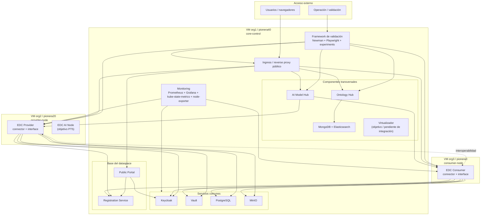

# 14. Plan del Entorno Productivo

## Objetivo

Este documento propone el plan necesario para evolucionar desde el entorno local
actual hacia un entorno productivo distribuido basado en 3 VMs.

No define todavía la arquitectura productiva final al detalle. Su propósito es:

- transformar el inventario local en un plan de despliegue productivo
- separar lo que ya es portable de lo que hoy es solo local
- identificar qué avances externos ya existen como referencia

## Fuentes de partida

La base de este plan es:

- `docs/12_local_validation_environment.md`
- `docs/11_ontology_hub_validation.md`
- `docs/13_test_cases.md`
- `docs/INVENTARIO DE ENTORNO.docx`
- la implementación real del framework actual

Como referencia externa adicional, se ha revisado:

- `RAFFAELE/Validation-Environment`

Esa referencia **no** se toma como fuente de verdad del framework actual, pero
sí como repositorio de avances orientados a despliegue en VM.

## Cómo usar `INVENTARIO DE ENTORNO.docx`

El documento `docs/INVENTARIO DE ENTORNO.docx` sí puede utilizarse como
referencia para el plan del entorno productivo, pero con un criterio concreto:

- sí debe usarse como inventario objetivo de bloques técnicos y operativos
- no debe usarse como descripción literal del framework actual
- no debe usarse como topología final cerrada del entorno productivo

La razón es que ese inventario mezcla dos niveles:

- un entorno PT5 mínimo comprimido en `1 Virtual Machine` con `Minikube`
- una lista de capacidades que también son válidas como objetivo productivo:
  `monitoring`, componentes PIONERA, servicios comunes, accesos externos y
  umbrales operativos

Por tanto, la lectura correcta para este plan es:

- `docs/12_local_validation_environment.md` describe el punto de partida real
- `docs/INVENTARIO DE ENTORNO.docx` aporta el inventario objetivo mínimo
- este documento (`14`) traduce ambos insumos a una propuesta distribuida en
  `3 VMs`

## Qué demuestra hoy el framework local

El framework actual ya aporta estos bloques reutilizables para productivo:

- orquestación por niveles
- despliegue por charts Helm
- separación entre servicios comunes, dataspace, conectores y componentes
- validación API core
- validación UI core
- validación funcional de `Ontology Hub`
- persistencia de experimentos y reporting

Y el inventario PT5 de referencia añade dos bloques que conviene conservar en
la propuesta productiva aunque todavía no estén integrados plenamente en el
framework principal:

- observabilidad (`Prometheus`, `Grafana`, `kube-state-metrics`,
  `node-exporter`)
- componentes objetivo como `Virtualizador` y `EDC AI Node`

## Qué sigue siendo local-only

Los principales elementos todavía específicos del entorno local son:

| Elemento | Situación local actual | Implicación productiva |
| --- | --- | --- |
| `Minikube` | clúster único local | debe sustituirse por la plataforma K8s real o equivalente por VM |
| `minikube tunnel` | requisito de exposición local | debe sustituirse por exposición real de red |
| `/etc/hosts` y `hostAliases` | resolución artificial de dominios | deben sustituirse por DNS/routing reales |
| build local + `minikube image load` | flujo local de imágenes | debe sustituirse por registry y promoción de imágenes |
| todo en el namespace `demo` | compresión local de servicios y roles | debe redistribuirse entre VMs y servicios productivos |

## Avances detectados en `RAFFAELE/Validation-Environment`

La revisión del repositorio de referencia muestra avances orientados a VM en
cinco bloques:

| Bloque | Evidencia en RAFFAELE | Valor como referencia |
| --- | --- | --- |
| dominios dinámicos | `patch_helm_templates` | adaptar el repositorio de despliegue a dominios reales |
| exposición de ingress con IP de VM | `patch_ingress_external_ip` | hacer accesibles los servicios fuera del entorno local |
| gestión reforzada de `hosts` | `manage_hosts_entries` | facilitar resolución mientras no exista DNS real |
| auto-healing de Vault token | `sync_vault_token_to_deployer_config` | robustez operativa tras sincronizaciones o cambios de máquina |
| limpieza robusta de bases de datos | `pg_terminate_backend` / `force_clean_postgres_db` | redeployments limpios |

## Qué ya existe en el framework actual y qué no

| Capacidad | Estado en framework actual | Estado en referencia RAFFAELE |
| --- | --- | --- |
| gestión de `hosts` | sí | sí |
| sincronización de token Vault | sí | sí |
| limpieza robusta de bases de datos | sí | sí |
| parcheo global de dominios dinámicos | no | sí |
| parcheo automático de IP externa de ingress | no | sí |

## Plan propuesto de levantamiento productivo

## Fase 1. Congelar el inventario de referencia

Antes de desplegar en VMs, hay que fijar como inventario base:

- servicios comunes
- servicios del dataspace
- conectores
- componentes
- puntos de entrada
- validaciones que deben seguir pasando

Documentos de base:

- `docs/12_local_validation_environment.md`
- `docs/11_ontology_hub_validation.md`

## Fase 2. Separar lo portable de lo local-only

Hay que clasificar cada mecanismo del local actual como:

- portable sin cambios
- portable con parametrización
- solo local

### Resultado esperado

Una matriz tipo:

| Elemento local | Estado | Acción productiva |
| --- | --- | --- |
| charts Helm | portable | reutilizar |
| suites Newman/Playwright | portable | reutilizar apuntando a endpoints productivos |
| `minikube tunnel` | solo local | eliminar |
| `hostAliases` | solo local o transición | sustituir por DNS o routing reales |
| imágenes `:local` | solo local | sustituir por imágenes publicadas |

## Fase 3. Parametrizar dominios y exposición de red

Este es uno de los bloques clave para pasar a VMs.

### Necesario

- parametrizar dominios públicos reales
- exponer ingress con IP o mecanismo equivalente del entorno objetivo
- revisar la resolución de URLs usadas por conectores y componentes

### Referencia útil

Los avances de `RAFFAELE/Validation-Environment` sugieren dos caminos
concretos:

- parcheo global de dominios usando `DOMAIN_BASE` y `DS_DOMAIN_BASE`
- parcheo automático del `ingress-nginx-controller` con la IP real de la VM

### Recomendación

Este bloque debe incorporarse al framework principal antes de pretender un
levantamiento productivo repetible.

## Fase 3.1. Propuesta concreta de dominios y endpoints

Para derivar endpoints productivos concretos a partir del framework local hay
que tener en cuenta dos hechos:

- el framework actual y los charts Helm están mucho más alineados con routing
  por hostname que con routing por path
- las VMs disponibles ya tienen HTTPS operativo en:
  - `https://org1.pionera.oeg.fi.upm.es`
  - `https://org2.pionera.oeg.fi.upm.es`
  - `https://org3.pionera.oeg.fi.upm.es`

La propuesta correcta, por tanto, es distinguir dos niveles:

1. **objetivo recomendado**
   - endpoints por hostname
   - más alineado con el framework actual
   - menos intrusivo para charts y aplicaciones
2. **bootstrap viable**
   - aprovechar directamente los dominios HTTPS ya existentes
   - útil para una primera puesta en marcha si todavía no hay DNS/TLS por
     servicio
   - más costoso si hay que adaptar aplicaciones a prefijos por path

### Modelo objetivo recomendado

Este es el modelo que mejor encaja con la estructura actual del framework.

| Servicio | Endpoint propuesto | VM | Observación |
| --- | --- | --- | --- |
| Portal público frontend | `https://portal.org1.pionera.oeg.fi.upm.es` | `org1` | cara pública principal del dataspace |
| Portal público backend | `https://backend.org1.pionera.oeg.fi.upm.es` | `org1` | backend del portal |
| Registration Service | `https://registration-service.org1.pionera.oeg.fi.upm.es` | `org1` | registro base del dataspace |
| Keycloak | `https://keycloak.org1.pionera.oeg.fi.upm.es` | `org1` | autenticación |
| Keycloak Admin | `https://keycloak-admin.org1.pionera.oeg.fi.upm.es` | `org1` | administración |
| MinIO API | `https://minio.org1.pionera.oeg.fi.upm.es` | `org1` | almacenamiento objeto |
| MinIO Console | `https://console-minio.org1.pionera.oeg.fi.upm.es` | `org1` | consola de administración |
| Ontology Hub | `https://ontology-hub.org1.pionera.oeg.fi.upm.es` | `org1` | componente transversal |
| AI Model Hub | `https://ai-model-hub.org1.pionera.oeg.fi.upm.es` | `org1` | componente transversal |
| Grafana | `https://grafana.org1.pionera.oeg.fi.upm.es` | `org1` | observabilidad |
| Prometheus | `https://prometheus.org1.pionera.oeg.fi.upm.es` | `org1` | observabilidad |
| Provider connector base | `https://provider.org2.pionera.oeg.fi.upm.es` | `org2` | base pública del conector provider |
| Consumer connector base | `https://consumer.org3.pionera.oeg.fi.upm.es` | `org3` | base pública del conector consumer |

### Endpoints funcionales derivados del modelo objetivo

| Bloque | Endpoint |
| --- | --- |
| Provider management | `https://provider.org2.pionera.oeg.fi.upm.es/management` |
| Provider api | `https://provider.org2.pionera.oeg.fi.upm.es/api` |
| Provider protocol | `https://provider.org2.pionera.oeg.fi.upm.es/protocol` |
| Provider UI | `https://provider.org2.pionera.oeg.fi.upm.es/dataspaceunit-connector-interface/` |
| Consumer management | `https://consumer.org3.pionera.oeg.fi.upm.es/management` |
| Consumer api | `https://consumer.org3.pionera.oeg.fi.upm.es/api` |
| Consumer protocol | `https://consumer.org3.pionera.oeg.fi.upm.es/protocol` |
| Consumer UI | `https://consumer.org3.pionera.oeg.fi.upm.es/dataspaceunit-connector-interface/` |
| Ontology Hub dataset | `https://ontology-hub.org1.pionera.oeg.fi.upm.es/dataset` |
| Ontology Hub edition | `https://ontology-hub.org1.pionera.oeg.fi.upm.es/edition` |
| AI Model Hub home | `https://ai-model-hub.org1.pionera.oeg.fi.upm.es/` |

### Modelo bootstrap con los dominios HTTPS ya existentes

Si se quiere arrancar antes de tener DNS/TLS por servicio, el uso más directo
de las VMs actuales sería este:

| Servicio o bloque | Endpoint bootstrap | VM | Nota |
| --- | --- | --- | --- |
| Portal público | `https://org1.pionera.oeg.fi.upm.es/` | `org1` | punto de entrada inicial más natural |
| Provider connector base | `https://org2.pionera.oeg.fi.upm.es` | `org2` | encaja muy bien porque la VM es casi monolítica para ese rol |
| Consumer connector base | `https://org3.pionera.oeg.fi.upm.es` | `org3` | mismo criterio que provider |
| Provider management | `https://org2.pionera.oeg.fi.upm.es/management` | `org2` | reutiliza el patrón actual del conector |
| Provider api | `https://org2.pionera.oeg.fi.upm.es/api` | `org2` | reutiliza el patrón actual del conector |
| Provider protocol | `https://org2.pionera.oeg.fi.upm.es/protocol` | `org2` | reutiliza el patrón actual del conector |
| Provider UI | `https://org2.pionera.oeg.fi.upm.es/dataspaceunit-connector-interface/` | `org2` | reutiliza el patrón actual del conector |
| Consumer management | `https://org3.pionera.oeg.fi.upm.es/management` | `org3` | reutiliza el patrón actual del conector |
| Consumer api | `https://org3.pionera.oeg.fi.upm.es/api` | `org3` | reutiliza el patrón actual del conector |
| Consumer protocol | `https://org3.pionera.oeg.fi.upm.es/protocol` | `org3` | reutiliza el patrón actual del conector |
| Consumer UI | `https://org3.pionera.oeg.fi.upm.es/dataspaceunit-connector-interface/` | `org3` | reutiliza el patrón actual del conector |

Para `org1`, un bootstrap por path sería posible conceptualmente, por ejemplo:

- `https://org1.pionera.oeg.fi.upm.es/ontology-hub/`
- `https://org1.pionera.oeg.fi.upm.es/ai-model-hub/`
- `https://org1.pionera.oeg.fi.upm.es/keycloak/`
- `https://org1.pionera.oeg.fi.upm.es/grafana/`

pero **no es el estado recomendado** porque requeriría más adaptación en
ingress, reescrituras y posiblemente en aplicaciones. Por eso el objetivo debe
seguir siendo hostname dedicado por servicio en `org1`.

### Mapeo conceptual local -> productivo

| Endpoint local actual | Endpoint productivo recomendado |
| --- | --- |
| `http://demo.dev.ds.dataspaceunit.upm` | `https://portal.org1.pionera.oeg.fi.upm.es` |
| `http://backend-demo.dev.ds.dataspaceunit.upm` | `https://backend.org1.pionera.oeg.fi.upm.es` |
| `http://registration-service-demo.dev.ds.dataspaceunit.upm` | `https://registration-service.org1.pionera.oeg.fi.upm.es` |
| `http://keycloak.dev.ed.dataspaceunit.upm` | `https://keycloak.org1.pionera.oeg.fi.upm.es` |
| `http://keycloak-admin.dev.ed.dataspaceunit.upm` | `https://keycloak-admin.org1.pionera.oeg.fi.upm.es` |
| `http://minio.dev.ed.dataspaceunit.upm` | `https://minio.org1.pionera.oeg.fi.upm.es` |
| `http://console.minio-s3.dev.ed.dataspaceunit.upm` | `https://console-minio.org1.pionera.oeg.fi.upm.es` |
| `http://ontology-hub-demo.dev.ds.dataspaceunit.upm` | `https://ontology-hub.org1.pionera.oeg.fi.upm.es` |
| `http://ai-model-hub-demo.dev.ds.dataspaceunit.upm` | `https://ai-model-hub.org1.pionera.oeg.fi.upm.es` |
| `http://conn-citycouncil-demo.dev.ds.dataspaceunit.upm` | `https://provider.org2.pionera.oeg.fi.upm.es` |
| `http://conn-company-demo.dev.ds.dataspaceunit.upm` | `https://consumer.org3.pionera.oeg.fi.upm.es` |

## Fase 3.2. Variables objetivo de configuración

El modelo actual del framework gira principalmente alrededor de dos variables:

- `DOMAIN_BASE`
- `DS_DOMAIN_BASE`

Eso es suficiente para el entorno local y para un productivo comprimido en un
único dominio, pero **no basta** para expresar correctamente un reparto real en
`3 VMs` con:

- servicios comunes y componentes en `org1`
- provider en `org2`
- consumer en `org3`

Por tanto, para soportar el plan productivo propuesto hacen falta variables más
explícitas por servicio o por bloque funcional.

### Variables mínimas recomendadas

| Variable propuesta | Valor objetivo |
| --- | --- |
| `COMMON_DOMAIN_BASE` | `org1.pionera.oeg.fi.upm.es` |
| `PORTAL_HOST` | `portal.org1.pionera.oeg.fi.upm.es` |
| `PORTAL_BACKEND_HOST` | `backend.org1.pionera.oeg.fi.upm.es` |
| `REGISTRATION_SERVICE_HOST` | `registration-service.org1.pionera.oeg.fi.upm.es` |
| `KEYCLOAK_HOST` | `keycloak.org1.pionera.oeg.fi.upm.es` |
| `KEYCLOAK_ADMIN_HOST` | `keycloak-admin.org1.pionera.oeg.fi.upm.es` |
| `MINIO_HOST` | `minio.org1.pionera.oeg.fi.upm.es` |
| `MINIO_CONSOLE_HOST` | `console-minio.org1.pionera.oeg.fi.upm.es` |
| `ONTOLOGY_HUB_HOST` | `ontology-hub.org1.pionera.oeg.fi.upm.es` |
| `AI_MODEL_HUB_HOST` | `ai-model-hub.org1.pionera.oeg.fi.upm.es` |
| `GRAFANA_HOST` | `grafana.org1.pionera.oeg.fi.upm.es` |
| `PROMETHEUS_HOST` | `prometheus.org1.pionera.oeg.fi.upm.es` |
| `PROVIDER_CONNECTOR_HOST` | `provider.org2.pionera.oeg.fi.upm.es` |
| `CONSUMER_CONNECTOR_HOST` | `consumer.org3.pionera.oeg.fi.upm.es` |

### Variables de compatibilidad transitoria

Para no romper el framework de golpe, conviene mantener temporalmente:

| Variable actual | Uso transitorio recomendado |
| --- | --- |
| `DOMAIN_BASE` | mapearla a `COMMON_DOMAIN_BASE` mientras se migra el código |
| `DS_DOMAIN_BASE` | usarla solo como fallback genérico, no como fuente principal de hosts productivos |

La lectura práctica sería:

- `DOMAIN_BASE=org1.pionera.oeg.fi.upm.es`
- `DS_DOMAIN_BASE=org1.pionera.oeg.fi.upm.es`

solo como compatibilidad, mientras los conectores y componentes pasan a usar
sus propios `*_HOST`.

## Fase 3.3. Cambios concretos necesarios en charts y plantillas

Para que el framework soporte los endpoints productivos propuestos hay que
modificar varios puntos concretos.

### 1. Servicios comunes

Hoy varios hosts siguen fijos o implícitos en el dominio local.

**Archivos a adaptar**

- `inesdata-deployment/common/values.yaml`
- `adapters/inesdata/config.py`

**Cambios necesarios**

- parametrizar:
  - `KEYCLOAK_HOST`
  - `KEYCLOAK_ADMIN_HOST`
  - `MINIO_HOST`
  - `MINIO_CONSOLE_HOST`
- dejar de asumir:
  - `keycloak.dev.ed.dataspaceunit.upm`
  - `keycloak-admin.dev.ed.dataspaceunit.upm`
  - `minio.dev.ed.dataspaceunit.upm`
  - `console.minio-s3.dev.ed.dataspaceunit.upm`

### 2. Registration Service

Hoy el chart deriva el hostname desde `dataspace_name` y `DS_DOMAIN_BASE`.

**Archivo a adaptar**

- `inesdata-deployment/dataspace/registration-service/values.yaml.tpl`

**Cambio necesario**

- permitir `REGISTRATION_SERVICE_HOST` explícito
- no construir siempre:
  - `registration-service-<dataspace>.<domain>`

### 3. Public Portal

Hoy el portal ya separa frontend y backend, pero sigue atado a derivaciones de
dominio y a `CHANGEME` para conectores.

**Archivo a adaptar**

- `inesdata-deployment/dataspace/public-portal/values.yaml.tpl`

**Cambios necesarios**

- parametrizar:
  - `PORTAL_HOST`
  - `PORTAL_BACKEND_HOST`
- sustituir `CHANGEME-conn-NAME-...` por:
  - `PROVIDER_CONNECTOR_HOST`
  - y, si hace falta en vistas futuras, `CONSUMER_CONNECTOR_HOST`

### 4. Connectores

Hoy el chart del conector asume un patrón uniforme:

- `connector_name.<single-domain>`

Eso ya no sirve para `provider` en `org2` y `consumer` en `org3`.

**Archivo a adaptar**

- `inesdata-deployment/connector/values.yaml.tpl`

**Cambios necesarios**

- permitir `CONNECTOR_PUBLIC_HOST` explícito por despliegue
- o, mejor, derivarlo desde:
  - `PROVIDER_CONNECTOR_HOST`
  - `CONSUMER_CONNECTOR_HOST`
- dejar de depender solo de:
  - `{{ keys.connector_name }}.<domain>`

### 5. Ontology Hub

Hoy `Ontology Hub` sigue usando host fijo demo y además necesita coherencia
entre el host público y `SELF_HOST_URL`.

**Archivo a adaptar**

- `inesdata-deployment/components/ontology-hub/values-demo.yaml`

**Cambios necesarios**

- convertirlo en configuración productiva parametrizable o plantilla equivalente
- parametrizar:
  - `ONTOLOGY_HUB_HOST`
  - `SELF_HOST_URL`
- asegurar que `SELF_HOST_URL` y el host público apunten al endpoint real de
  `org1`

### 6. AI Model Hub

Hoy `AI Model Hub` sigue fijando:

- su propio host demo
- las URLs de management/default/protocol de provider y consumer

**Archivo a adaptar**

- `inesdata-deployment/components/ai-model-hub/values-demo.yaml`

**Cambios necesarios**

- parametrizar:
  - `AI_MODEL_HUB_HOST`
  - `PROVIDER_CONNECTOR_HOST`
  - `CONSUMER_CONNECTOR_HOST`
- reconstruir desde ahí:
  - `/management`
  - `/api`
  - `/protocol`

### 7. Framework Python

El código Python todavía asume en varios puntos que `DOMAIN_BASE` y
`DS_DOMAIN_BASE` bastan para todo.

**Archivos a adaptar**

- `adapters/inesdata/config.py`
- `inesdata.py`
- `adapters/inesdata/connectors.py`
- `adapters/inesdata/components.py`

**Cambios necesarios**

- introducir lectura centralizada de hosts explícitos
- usar esos hosts para:
  - generación de `values`
  - mensajes operativos
  - readiness
  - preparación de UI tests
- reducir el papel de `hostAliases` a transición o debug

### 8. Capa de validación UI

La validación UI hoy sigue heredando defaults del dominio local.

**Archivos a adaptar**

- `validation/ui/shared/utils/dataspace-runtime.ts`
- `validation/ui/shared/utils/minio-console-runtime.ts`
- `validation/components/ontology_hub/ui/runtime.js`
- `validation/components/ai_model_hub/ui/runtime.js`

**Cambios necesarios**

- permitir URLs explícitas por servicio
- no inferir todo solo desde:
  - `UI_DOMAIN_BASE`
  - `UI_DS_DOMAIN`
- usar directamente:
  - `UI_PROVIDER_BASE_URL`
  - `UI_CONSUMER_BASE_URL`
  - `UI_PORTAL_URL`
  - `UI_ONTOLOGY_HUB_URL`
  - `UI_AI_MODEL_HUB_URL`

### 9. Aplicaciones con URLs hardcoded

Hay al menos una clase de problemas que no se resuelve solo con Helm:
fuentes con URLs demo embebidas.

**Ejemplos actuales**

- `adapters/inesdata/sources/inesdata-connector-interface/src/environments/environment.ts`
- `adapters/inesdata/sources/inesdata-connector-interface/src/environments/environment.prod.ts`
- `adapters/inesdata/sources/inesdata-connector-interface/src/app/shared/services/ontology.service.ts`

**Cambio necesario**

- externalizar la URL de `Ontology Hub`
- dejar de fijar:
  - `http://ontology-hub-demo.dev.ds.dataspaceunit.upm/dataset`

## Fase 3.4. Orden recomendado de implementación técnica

Para no abrir demasiados frentes a la vez, el orden más sensato sería:

1. introducir variables `*_HOST` en el framework Python
2. adaptar charts Helm de:
   - comunes
   - registration-service
   - portal
   - conectores
3. adaptar `Ontology Hub` y `AI Model Hub`
4. adaptar la capa de validación UI
5. eliminar dependencias residuales de `DOMAIN_BASE` y `DS_DOMAIN_BASE`
6. revisar y limpiar URLs hardcoded en aplicaciones

## Fase 4. Definir la distribución lógica en 3 VMs

Sin cerrar todavía el diseño final al detalle de red o hardening, el reparto
más coherente con el framework actual es separar tres grupos:

- servicios comunes / control
- lado provider
- lado consumer

### Propuesta concreta de reparto en 3 VMs

Las VMs disponibles hoy, con conectividad mutua por `ssh` y dominios HTTPS ya
resueltos, son una muy buena base para fijar el reparto conceptual:

- `pionera40` -> `https://org1.pionera.oeg.fi.upm.es`
- `pionera20` -> `https://org2.pionera.oeg.fi.upm.es`
- `pionera3` -> `https://org3.pionera.oeg.fi.upm.es`

La propuesta de reparto queda así:

| VM | Rol propuesto | Elementos a desplegar | Justificación |
| --- | --- | --- | --- |
| `org1` / `pionera40` | `core-control` | Keycloak, Vault, PostgreSQL, MinIO, `registration-service`, `public-portal`, `Ontology Hub` con sus dependencias internas, `AI Model Hub`, `monitoring`, ingress público compartido y ejecución del framework de validación | concentra servicios compartidos, observabilidad y componentes de acceso transversal |
| `org2` / `pionera20` | `provider-node` | conector provider (`conn-citycouncil-demo`) y sus dependencias operativas locales mínimas | aísla el lado proveedor del flujo de intercambio |
| `org3` / `pionera3` | `consumer-node` | conector consumer (`conn-company-demo`) y sus dependencias operativas locales mínimas | aísla el lado consumidor del flujo de intercambio |

### Lectura de esta propuesta

La propuesta no nace de una preferencia arbitraria, sino de la implementación
local actual:

- los servicios comunes ya están centralizados conceptualmente
- `registration-service` y `public-portal` ya actúan como base compartida del
  dataspace
- `AI Model Hub` consume ambos conectores y encaja mejor como componente
  centralizado que como servicio atado a un único lado
- `Ontology Hub` no depende del flujo provider-consumer para su operación
  principal y encaja mejor como componente central
- los dos conectores son el bloque natural a separar en provider y consumer

### Distribución funcional detallada

#### VM-1 `core-control`

Debe agrupar:

- Keycloak
- Vault
- PostgreSQL
- MinIO
- `monitoring`:
  - Prometheus
  - Grafana
  - `kube-state-metrics`
  - `node-exporter` o equivalente operativo
- `registration-service`
- `public-portal`
- `ontology-hub`
  - MongoDB
  - Elasticsearch
- `ai-model-hub`
- punto de entrada público del entorno
- framework de validación y almacenamiento de `experiments/`

#### VM-2 `provider-node`

Debe agrupar:

- conector provider
- su `connector-interface`
- secretos/configuración necesarios para operar contra servicios comunes
- exposición de sus endpoints management, protocol y api

#### VM-3 `consumer-node`

Debe agrupar:

- conector consumer
- su `connector-interface`
- secretos/configuración necesarios para operar contra servicios comunes
- exposición de sus endpoints management, protocol y api

### Elementos objetivo todavía no consolidados en el framework principal

El inventario PT5 de referencia incluye dos bloques que no deben perderse en el
plan productivo, aunque hoy sigan siendo parciales o gap en el framework local:

| Elemento | Estado actual | Lectura correcta para productivo |
| --- | --- | --- |
| `monitoring` | no integrado como despliegue estándar del framework principal | debe incluirse en el diseño productivo |
| `Virtualizador` | gap en la implementación principal actual | debe mantenerse como bloque objetivo, pendiente de integración |
| `EDC AI Node` | aparece en el inventario PT5, no en `deployer.config` actual | debe tratarse como capacidad objetivo, no como realidad ya integrada |

## Fase 4.1. Diagrama conceptual del entorno productivo

El siguiente diagrama no pretende cerrar todos los detalles de red, pero sí
deja una vista coherente y útil de cómo debería quedar estructurado el entorno
productivo derivado del framework local actual y del inventario PT5 de
referencia.

### Qué mantiene esta propuesta

- la separación lógica ya presente en el entorno local
- el patrón provider-consumer del framework
- la centralización conceptual de identidad, secretos, almacenamiento y portal
- la capacidad de reutilizar Newman y Playwright casi sin rehacer la capa de
  validación

### Qué obliga a definir después

- topología de ingress o reverse proxy entre las tres VMs
- estrategia DNS real
- estrategia de almacenamiento persistente para servicios comunes
- ubicación final exacta del framework de validación si no se quiere ejecutar en
  `VM-1`
- si `monitoring` vive totalmente en `VM-1` o se distribuye parcialmente
- encaje final del `Virtualizador` y del `EDC AI Node`

### Qué debe decidirse

| Decisión | Razón |
| --- | --- |
| dónde viven Keycloak, Vault, MinIO y PostgreSQL | hoy son servicios comunes centralizados |
| qué VM aloja el provider | hoy está comprimido en el namespace `demo` |
| qué VM aloja el consumer | hoy está comprimido en el namespace `demo` |
| si `Ontology Hub` y `AI Model Hub` viven en `VM-1` u otra VM de servicios | hoy coexisten en local con el dataspace |
| si el framework de validación corre en `VM-1` o en una máquina aparte de operación | hoy corre fuera del clúster desde el host |

## Fase 5. Adaptar el despliegue de componentes

Para productivo, los componentes deben dejar de depender de:

- build local en el host
- `minikube image load`
- supuestos de hostnames locales fijos

### Acciones

- publicar imágenes versionadas
- parametrizar hosts públicos
- revisar dependencias de autoacceso
- validar que cada componente pueda vivir fuera del único namespace local

## Fase 6. Adaptar la validación al nuevo entorno

La validación no debe rehacerse; debe reorientarse.

### Se mantiene

- Newman core
- Playwright core
- validación por componente
- experiments y reporting

### Debe cambiar

- resolución de endpoints
- preparación de credenciales
- readiness distribuida
- supuestos de red local

## Fase 7. Introducir automatización productiva gradualmente

El orden recomendado es:

1. desplegar servicios comunes
2. desplegar dataspace base
3. desplegar provider
4. desplegar consumer
5. desplegar componentes
6. ejecutar validación core
7. ejecutar validación UI
8. ejecutar validación por componente

## Fase 8. Criterio de aceptación del paso a productivo

El entorno productivo no debería considerarse listo hasta que:

- reproduzca el inventario funcional esencial del entorno local
- exponga los puntos de entrada necesarios sin hacks locales
- permita correr `Level 6` o su equivalente productivo
- mantenga evidencia reproducible en `experiments/`

## Entregables previos al levantamiento productivo

Antes de ejecutar el levantamiento real en VMs, deberían existir:

| Entregable | Estado esperado |
| --- | --- |
| inventario local consolidado | completado |
| mapa local-only vs portable | completado |
| decisión de distribución en 3 VMs | pendiente |
| estrategia de dominios e ingress | pendiente |
| estrategia de publicación de imágenes | pendiente |
| adaptación del framework principal con automatización productiva reutilizable | pendiente |

## Conclusión

El paso correcto no es rediseñar el sistema desde cero, sino aplicar este orden:

1. inventariar el local real
2. separar mecanismos locales de mecanismos portables
3. incorporar al framework principal las capacidades de automatización en VM que
   ya aparecen como referencia en `RAFFAELE/Validation-Environment`
4. desplegar por fases el entorno distribuido
5. reutilizar la capa de validación existente como criterio de aceptación

Con ese enfoque, el entorno productivo queda derivado del framework local en
lugar de convertirse en una arquitectura paralela difícil de validar.
