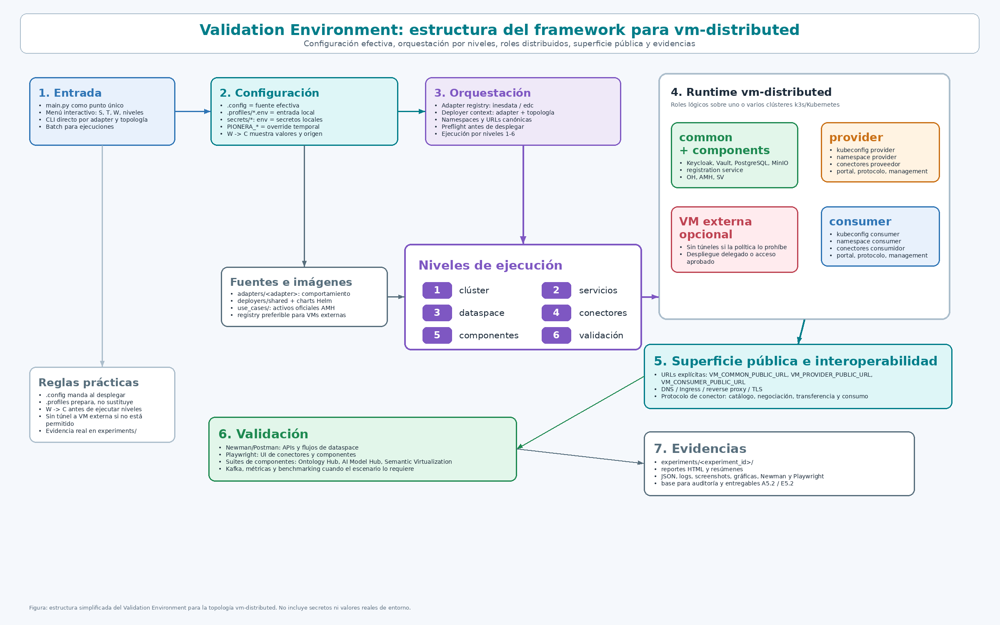

# Estructura del framework para `vm-distributed`

Este documento resume cómo se organiza el Validation Environment cuando se usa
la topología `vm-distributed`. La vista combina estructura de repositorio,
fuentes de configuración, orquestación por niveles, roles de infraestructura,
validación y generación de evidencias.

## Vista simplificada en PNG

Esta versión está pensada para presentaciones, anexos o explicación oral del
framework. La imagen puede reemplazarse más adelante por un diagrama propio
manteniendo el mismo propósito documental.

## Cómo leerlo

La lectura recomendada es de izquierda a derecha y de arriba abajo:

1. El operador entra por `main.py`, ya sea desde menú, CLI o batch.
2. El framework resuelve configuración desde `.config`, perfiles locales,
   secretos locales y variables `PIONERA_*`.
3. El asistente `W` ayuda a preparar `vm-distributed`, revisar valores efectivos
   con `W -> C`, ejecutar preflights y preparar kubeconfigs o SSH cuando la
   política de red lo permite.
4. La ejecución por niveles despliega clúster, servicios comunes, dataspace,
   conectores, componentes y validación.
5. La topología distribuida separa roles `common`, `provider`, `consumer` y, si
   aplica, `components`.
6. Las validaciones usan las URLs públicas, endpoints de protocolo, componentes
   y conectores ya desplegados.
7. El resultado final queda bajo `experiments/` como evidencias, reportes y
   artefactos auditables.

## Zonas del diagrama

| Zona | Qué explica |
| --- | --- |
| `1. Entrada` | Punto de acceso operativo al framework: `main.py`, menú interactivo, CLI por adapter/topología y ejecución batch. |
| `2. Configuración` | Fuentes que alimentan el despliegue: `.config`, `.profiles/*.env`, `secrets/*` y sobrescrituras `PIONERA_*`. |
| `3. Orquestación` | Resolución de adapter, topología, namespaces, URLs canónicas, preflights y ejecución por niveles. |
| `Fuentes e imágenes` | Código de adapters, charts compartidos, casos de uso oficiales de AI Model Hub e imágenes usadas por el despliegue. |
| `Niveles de ejecución` | Secuencia lógica del framework: clúster, servicios comunes, dataspace, conectores, componentes y validación. |
| `4. Runtime vm-distributed` | Roles lógicos desplegados o integrados en la topología: `common + components`, `provider`, `consumer` y VM externa opcional. |
| `5. Superficie pública e interoperabilidad` | URLs públicas, DNS, Ingress, reverse proxy, TLS y protocolo de conector usados para interoperar y validar. |
| `6. Validación` | Suites Newman/Postman, Playwright, pruebas de componentes, Kafka, métricas y benchmarking cuando aplica. |
| `7. Evidencias` | Directorios `experiments/<experiment_id>/`, reportes, JSON, logs, capturas y gráficas usadas para auditoría y entregables. |

La figura no intenta representar todos los ficheros del repositorio. Su función
es mostrar la relación entre operación, configuración, despliegue, runtime,
validación y evidencias para la topología `vm-distributed`.

## Puntos clave para explicar `vm-distributed`

- `.config` es la fuente efectiva del despliegue; `.profiles/*.env` solo prepara
  valores que después se aplican sobre los `.config`.
- `W -> C` es la forma más clara de demostrar qué valor efectivo usa el
  framework y de dónde procede.
- `vm-distributed` no significa obligatoriamente tres clústeres. Puede ser un
  clúster lógico con varios nodos, varios clústeres k3s por rol o una
  integración con conectores externos ya publicados.
- Si las políticas de red no autorizan túneles hacia una VM externa, la ruta
  viable es acceso aprobado directo, ejecución desde un host autorizado,
  registry compartido o despliegue delegado por la organización externa.
- El framework puede validar interoperabilidad contra endpoints públicos aunque
  no haya instalado directamente todos los conectores, siempre que el alcance se
  documente.
- La evidencia auditable no es el menú ni la configuración por sí solos: son los
  experimentos, reportes, logs y artefactos generados por Nivel 6.

## Relación con otros documentos

- [Mapa de configuración y despliegue](./49_configuration_map.md)
- [Guía operativa de vm-distributed](./46_vm_distributed_runbook.md)
- [Deployers y topologías](./35_deployers_and_topologies.md)
- [Manual técnico](./48_technical_manual.md)
- [Validación](./37_validation.md)
